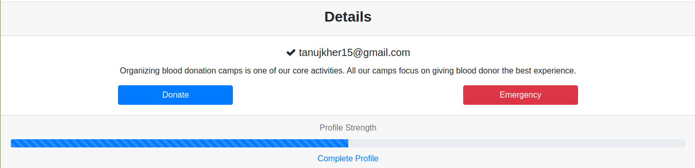

# Dengue Awareness and Blood Donation Site

## 1. Description

A simple project with signup, signin, authentication and express-sessions to keep track of logged in user followed by retrieving and storing data from user. Using this data to create a blood donation list for users in emergency and also telling the user about the state of completion of his profile.

## 2. NPM Libraries and Database used

* Express - for setting up server
* Express-Session - for keeping track of logged in user
* Hbs - To use handlebars for server side rendering of pages like profile, signup and signin with information from database
* Sequelize - To facilitate switching from one databse to another, make all functions generic and to add information to database
* Sqlite - To store data within the data file and not making database system specific

## 3. Run the Server

node server.js

## 4. URLs

### Signup: http://localhost:7722/signup

#### Signup form

#### Error in case of leaving any field blank

#### Successfull Signup

### Signin: http://localhost:7722/signin

#### Signin page

#### Wrong username

#### Wrong password

### Profile Page: http://localhost:7722/profile (redirects to Signin if not logged in)

#### Complete profile and Profile strength

based on the number of entries filled in Complete Profile form (stored in Users table)

#### Donate and Emergency Button

Redirect to details form in case of missing required details with the corresponding error

Donate button enlists user for donation in case required details are available and adds a tick in front of enlisted user's username

#### Emergency Response
Shows a list of all users who are enlisted and have same blood group and their details

Exchange info and error in case of sending exchange request again

Reflection on the request bar of user with whom information is exchanged

## 5. Heroku Link

### https://dengue-project.herokuapp.com/
